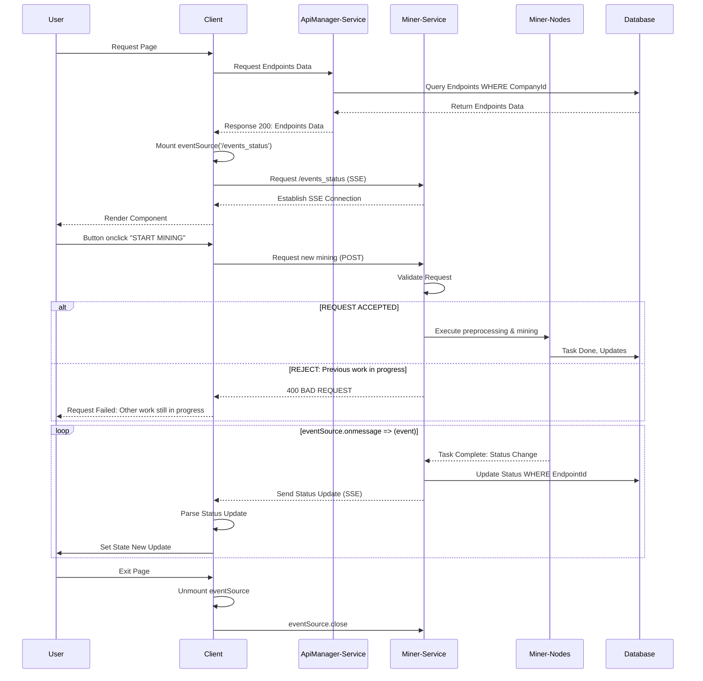

```mermaid
sequenceDiagram
    participant User as User
    participant Client as Client
    participant Server2 as ApiManager-Service
    participant Server as Miner-Service
    participant Miner as Miner-Nodes
    participant Database as Database

    User->>Client: Request Page
    Client->>Server2: Request Endpoints Data
    Server2->>Database: Query Endpoints WHERE CompanyId
    Database-->>Server2: Return Endpoints Data
    Server2-->>Client: Response 200: Endpoints Data

    Client->>Client: Mount eventSource('/events_status')
    Client->>Server: Request /events_status (SSE)
    Server-->>Client: Establish SSE Connection
    Client-->>User: Render Component
    User->>Client: Button onclick "START MINING"
    Client->>Server: Request new mining (POST)
    Server->>Server: Validate Request

    alt REQUEST ACCEPTED
      Server->>Miner: Execute preprocessing & mining
      Miner->>Database: Task Done, Updates
  
    else REJECT: Previous work in progress
      Server-->>Client: 400 BAD REQUEST
      Client-->>User: Request Failed: Other work still in progress
    end

    loop eventSource.onmessage => (event)
      Miner-->>Server: Task Complete: Status Change
      Server->>Database: Update Status WHERE EndpointId
      Server-->>Client: Send Status Update (SSE)
      Client->>Client: Parse Status Update
      Client->>User: Set State New Update
    end
    User->> Client: Exit Page
    Client->>Client: Unmount eventSource
    Client->> Server: eventSource.close
```