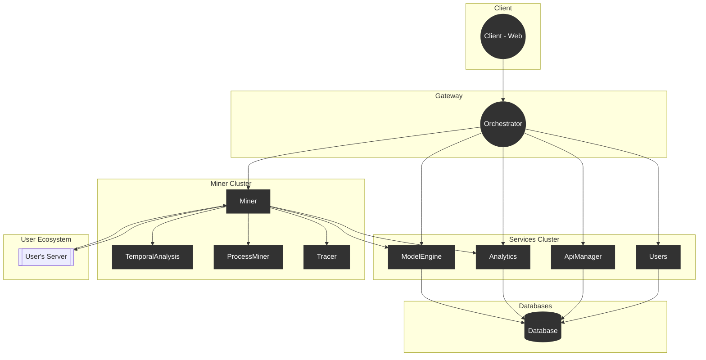

```mermaid
graph TD
    %% Subgraph for Client
    subgraph ClientGroup[Client]
        direction TB
        A((Client - Web))
    end

    %% Subgraph for Orchestrator
    subgraph OrchestratorGroup[Gateway]
        direction TB
        B((Orchestrator))
    end

    %% Subgraph for Services
    subgraph ServicesGroup[Services Cluster]
        direction TB
        C[Users]
        D[ApiManager]
        G[Analytics]
        H[ModelEngine]
    end

    %% Subgraph for Miner Internal Services
    subgraph MinerServices[Miner Cluster]
        direction TB
        I[Miner]
        J[TemporalAnalysis]
        K[ProcessMiner]
        L[Tracer]
    end

    %% Subgraph for Databases
    subgraph DatabasesGroup[Databases]
        direction TB
        E[(Database)]
    end

        %% Subgraph for Orchestrator
    subgraph UserGroup[User Ecosystem]
        direction TB
        F[[User's Server]]
    end

    %% Define the flow
    A --> B
    B --> C
    B --> D
    B --> G
    B --> H
    B --> I
    I --> J
    I --> K
    I --> L
    I --> H
    I --> G
    C --> E
    D --> E
    G --> E
    H --> E
    I --> F
    F --> I

    %% Custom styles
    style A fill:#323232,stroke:#333,stroke-width:2px,color:#fff;
    style B fill:#323232,stroke:#333,stroke-width:2px,color:#fff;
    style C fill:#323232,stroke:#333,stroke-width:2px,color:#fff;
    style D fill:#323232,stroke:#333,stroke-width:2px,color:#fff;
    style E fill:#323232,stroke:#333,stroke-width:2px,color:#fff;
    style G fill:#323232,stroke:#333,stroke-width:2px,color:#fff;
    style H fill:#323232,stroke:#333,stroke-width:2px,color:#fff;
    style I fill:#323232,stroke:#333,stroke-width:2px,color:#fff;
    style J fill:#323232,stroke:#333,stroke-width:2px,color:#fff;
    style K fill:#323232,stroke:#333,stroke-width:2px,color:#fff;
    style L fill:#323232,stroke:#333,stroke-width:2px,color:#fff;


```
