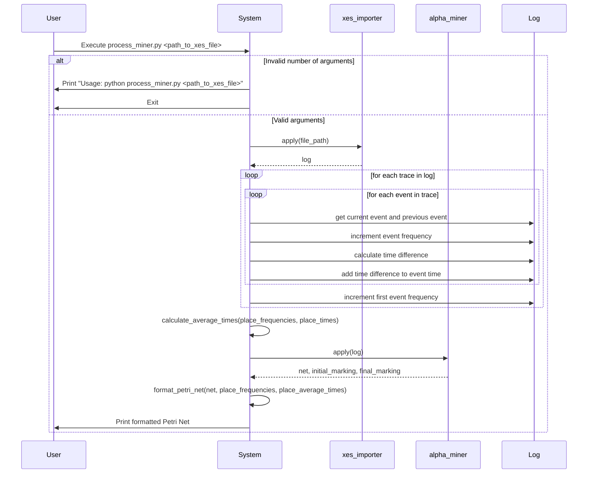

```mermaid
sequenceDiagram
    participant User
    participant System
    participant XESImporter as xes_importer
    participant AlphaMiner as alpha_miner
    participant Log

    User->>System: Execute process_miner.py <path_to_xes_file>
    alt Invalid number of arguments
        System->>User: Print "Usage: python process_miner.py <path_to_xes_file>"
        System->>User: Exit
    else Valid arguments
        System->>XESImporter: apply(file_path)
        XESImporter-->>System: log

        loop for each trace in log
            loop for each event in trace
                System->>Log: get current event and previous event
                System->>Log: increment event frequency
                System->>Log: calculate time difference
                System->>Log: add time difference to event time
            end
            System->>Log: increment first event frequency
        end

        System->>System: calculate_average_times(place_frequencies, place_times)
        System->>AlphaMiner: apply(log)
        AlphaMiner-->>System: net, initial_marking, final_marking

        System->>System: format_petri_net(net, place_frequencies, place_average_times)
        System->>User: Print formatted Petri Net
    end

```
