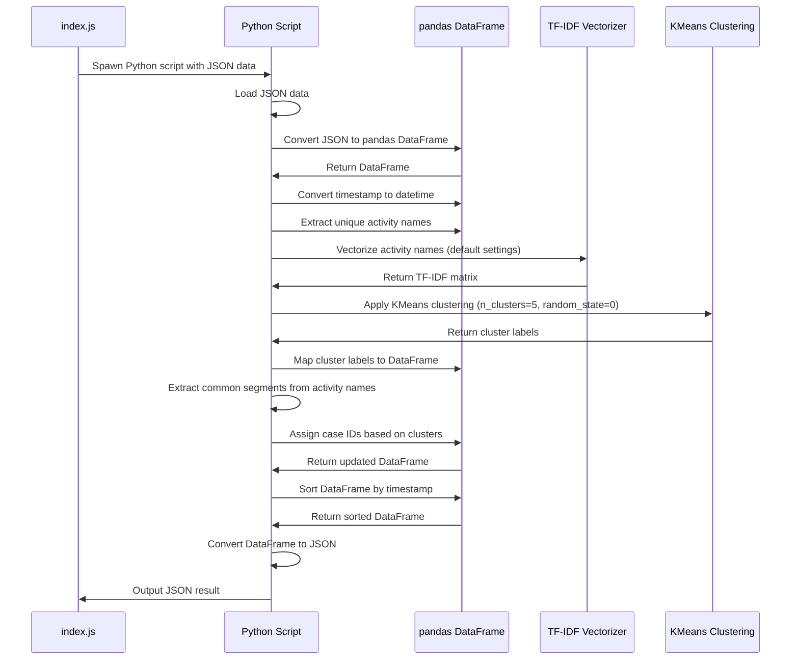

```mermaid
sequenceDiagram
    participant NodeJS as index.js
    participant Python as Python Script
    participant DataFrame as pandas DataFrame
    participant TFIDF as TF-IDF Vectorizer
    participant KMeans as KMeans Clustering

    NodeJS->>Python: Spawn Python script with JSON data
    Python->>Python: Load JSON data
    Python->>DataFrame: Convert JSON to pandas DataFrame
    DataFrame->>Python: Return DataFrame
    Python->>DataFrame: Convert timestamp to datetime
    Python->>DataFrame: Extract unique activity names
    Python->>TFIDF: Vectorize activity names (default settings)
    TFIDF->>Python: Return TF-IDF matrix
    Python->>KMeans: Apply KMeans clustering (n_clusters=5, random_state=0)
    KMeans->>Python: Return cluster labels
    Python->>DataFrame: Map cluster labels to DataFrame
    Python->>Python: Extract common segments from activity names
    Python->>DataFrame: Assign case IDs based on clusters
    DataFrame->>Python: Return updated DataFrame
    Python->>DataFrame: Sort DataFrame by timestamp
    DataFrame->>Python: Return sorted DataFrame
    Python->>Python: Convert DataFrame to JSON
    Python->>NodeJS: Output JSON result
```